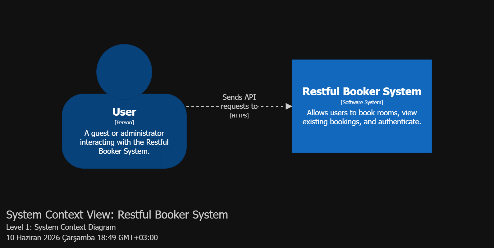
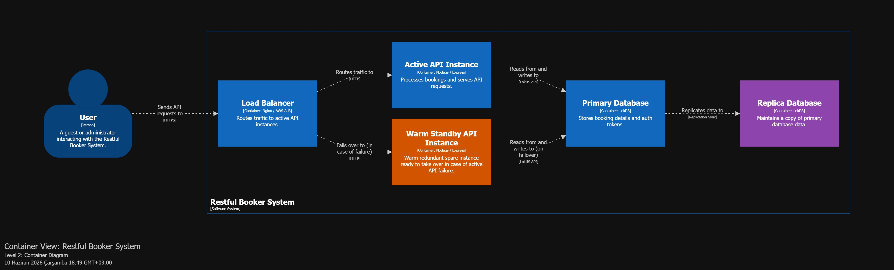
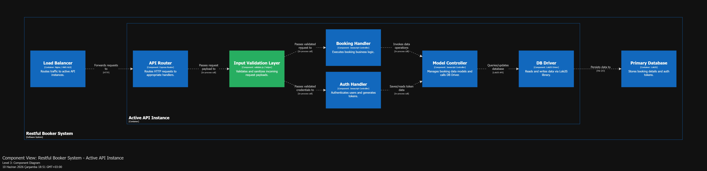

# Restful Booker — SE322 Software Architecture Project

A RESTful hotel booking API built with Node.js and Express, extended as part of the SE322 Software Architecture course.

---

## Group Members

| Name | Student ID |
|------|-----------|
| Hakan Keskinoğlu (TheGreatHakan) | — |
| Efe Demirel (EfeDemirel) | — |
| Alp Eren Kul | 22244710073 |

---

## Installation & Running

```bash
npm install
npm start
```

API is available at `http://localhost:3001`.

Run tests:
```bash
npm test
```

---

## New Endpoint — GET /booking/search

A new search endpoint was added that returns **full booking objects** (not just IDs), with optional filtering by name and date.

**URL:** `GET /booking/search`

**Query Parameters:**

| Parameter | Type | Description |
|-----------|------|-------------|
| `firstname` | string | Filter by guest first name |
| `lastname` | string | Filter by guest last name |
| `checkin` | date (YYYY-MM-DD) | Return bookings with check-in on or after this date |
| `checkout` | date (YYYY-MM-DD) | Return bookings with check-out on or before this date |

**Example Request:**
```
GET /booking/search?firstname=Sally&checkin=2013-02-01
```

**Example Response:**
```json
[
  {
    "bookingid": 1,
    "firstname": "Sally",
    "lastname": "Brown",
    "totalprice": 111,
    "depositpaid": true,
    "bookingdates": {
      "checkin": "2013-02-01",
      "checkout": "2013-02-04"
    },
    "additionalneeds": "Breakfast"
  }
]
```

---

## OpenAPI Specification

The full API is documented using the OpenAPI 3.1 standard.

File: [`docs/api/openapi.yaml`](docs/api/openapi.yaml)

Endpoints documented:
- `GET /ping` — Health check
- `POST /auth` — Generate auth token
- `GET /booking` — List all booking IDs (with filters)
- `POST /booking` — Create a booking
- `GET /booking/search` — Search full booking objects
- `GET /booking/{id}` — Get a specific booking
- `PUT /booking/{id}` — Full update (auth required)
- `PATCH /booking/{id}` — Partial update (auth required)
- `DELETE /booking/{id}` — Delete a booking (auth required)

---

## C4 Architecture Diagrams

The system architecture is modelled using the C4 model (Context, Container, Component) and documented with Structurizr DSL.

DSL file: [`docs/architecture/workspace.dsl`](docs/architecture/workspace.dsl)

### Level 1 — System Context

Shows the Restful Booker system and how it interacts with external users and infrastructure.



### Level 2 — Container

Shows the internal containers of the system, including the three architectural tactics applied.



### Level 3 — Component

Shows the internal components of the Active API Instance container.



---

## Architectural Tactics

Three architectural tactics were applied to improve the quality of the system:

### 1. Warm Redundant Spare (Availability)

A **Standby API Instance** is kept running alongside the primary Active API Instance. When the active instance fails, the load balancer immediately reroutes traffic to the standby — eliminating cold-start delay and minimising downtime. This tactic targets **availability** by reducing the mean time to repair (MTTR).

### 2. Input Validation (Security)

An **Input Validation Middleware** layer sits between the load balancer and the API instances. All incoming requests are validated and sanitised before reaching business logic. Malformed or invalid payloads are rejected early, preventing injection attacks and unexpected errors. This tactic targets **security** and **reliability**.

### 3. Maintain Multiple Copies of Data — Replication (Performance / Availability)

A **Replica Database** is kept in sync with the Primary Database. This provides data redundancy (no single point of failure for stored data) and enables read scalability by distributing read operations. This tactic targets **availability** and **performance**.

---

## Project Structure

```
restful-booker-se322/
├── docs/
│   ├── api/
│   │   └── openapi.yaml          # OpenAPI 3.1 specification
│   └── architecture/
│       ├── workspace.dsl          # Structurizr C4 DSL
│       ├── level1-system-context.png
│       ├── level2-container.png
│       └── level3-component.png
├── helpers/
│   └── parser.js                  # Response formatters (incl. bookingSearch)
├── models/
│   └── booking.js                 # Booking model + search method
├── routes/
│   └── index.js                   # Express routes (incl. GET /booking/search)
├── tests/
│   └── spec.js                    # Mocha/Chai/Supertest integration tests
└── app.js
```